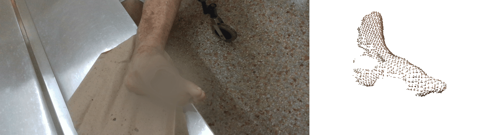

# 3D Reconstruction Pipeline for Diabetic Foot Ulcers

Jaume Adrover, Gabriel Moyá Alcover, José Maria Buades Rubio <br>
| [Docs](https://drive.google.com/file/d/1XTKcYXGFRgXhViSaoBWs7K-M7ZZwXTqp) | [Slides](https://docs.google.com/presentation/d/1_hLQ0bMLR88pabbE2PtKA5lz87QHIZISnBW6guoPzoc) |

An end-to-end 3D reconstruction pipeline for diabetic foot ulcers (DFU), built from Intel
RealSense recordings. It turns a raw `.bag` recording of a patient's foot into a cropped,
registered point cloud centered on the wound, ready for surface reconstruction.



The reconstruction (right) is deliberately cropped to a 45x45x45cm box around the wound and
built from SAM-segmented depth, so it only ever contains that tight region — it won't look
like the full original photo (left) on its own, which is why the two are shown side by side.
The wound is redacted in the photo (not just blurred — repainted with the surrounding skin
tone) since it's graphic medical content; the point cloud panel is left unredacted.

## Pipeline overview

`pipeline.py` runs the whole thing for one patient/date with a single command (see
[Usage](#usage)). Under the hood it's a sequence of standalone stages, each a script under
`src/`, that can also be run individually:

1. **Preprocessing** (`src/preprocessing/bag_extraction.py`) — extracts aligned color and
   depth frames from each patient's `.bag` recordings.

2. **Annotation** (`src/annotations/image_annotation.py`) — a small Tkinter tool for manually
   clicking the ulcer location on each color frame, saved to `annotations.csv`.

3. **Segmentation** (`src/annotations/sam_cleaner.py`) — runs Meta's Segment Anything (SAM) at
   the annotated point to get a full-leg mask per frame, and uses it to zero out irrelevant
   depth pixels.

4. **Point cloud creation** (`src/preprocessing/pcd_creation.py`) — back-projects each
   color/depth pair into a point cloud and crops a 45x45x45 cm bounding box centered on the
   wound.

5. **Registration** (`src/registration/run_registration.py`) — merges consecutive per-frame
   point clouds into a unified point cloud using Fast Global Registration (FGR) and ICP
   refinement, either sequentially or in batches.
   
6. **Visualization** (`src/visualization/viewer.py`) — steps through the reconstructed point
   clouds of a patient in an Open3D viewer.

Surface-meshing (Poisson, alpha shapes, ball pivoting) lives separately in
`src/surface_reconstruction/reconstruction.py` — see [Repo structure](#repo-structure).


## Setup

Requires Python 3.9+ (developed against 3.9.12).

```bash
pip install -r requirements.txt
```

The pipeline also expects, outside of version control:

- `data/` at the repo root — one folder per patient (`p_XXXX/YYYY-MM-DD/...`) containing the
  `.bag` recordings and derived color/depth/point-cloud data. Not shipped with the repo
  (see `.gitignore`).
- `data/intrinsic.json` — the RealSense camera intrinsics, lazily read on first use by
  `src/utils/intrinsics.py`.
- `models/checkpoints/sam_vit_b_01ec64.pth` — the SAM ViT-B checkpoint, used by
  `src/utils/image.py`'s `initSam()`. Download from the
  [Segment Anything repo](https://github.com/facebookresearch/segment-anything#model-checkpoints).

## Usage

Run everything from the repo root. `pipeline.py` sits at the root and works as a plain script;
the individual stage scripts live under `src/` and must be run as modules (`python -m ...`) so
their `src.` absolute imports resolve — running one directly (`python src/foo/bar.py`) will
fail with `ModuleNotFoundError: No module named 'src'`.

### Single execution

`pipeline.py` runs every stage for one patient/date in order:

```bash
python pipeline.py --patient p_0001 --date 2022-05-19 --strategy batch
```

It extracts frames, then annotates (skipped automatically if `annotations.csv` already
exists — otherwise a Tkinter window opens for you to click the wound on each frame, and the
rest of the pipeline continues once you close it), then SAM-segments, crops point clouds, and
registers them. See `--help` for the tunable registration thresholds (`--retry-attempts`,
`--inner-threshold`, `--batch-size`, `--batch-threshold`); `--strategy sequential` chain-merges
one pair of point clouds at a time instead of the default batch-then-fragment-merge.

### Running a single stage

Each stage can also be run on its own, e.g. to redo one step or inspect intermediate output:

```bash
python -m src.preprocessing.bag_extraction                                    # extract frames for all patients
python -m src.annotations.image_annotation                                    # click the wound location for one patient/date
python -m src.annotations.sam_cleaner                                         # SAM-segment depth frames for one patient/date
python -m src.preprocessing.pcd_creation                                      # crop point clouds around the wound
python -m src.registration.run_registration --patient p_0001 --date 2022-05-19 --strategy batch
python -m src.visualization.viewer                                            # step through the result
```

`bag_extraction`, `image_annotation`, `sam_cleaner`, and `pcd_creation` still take their
`patient`/`date` from the top of their `if __name__ == "__main__":` block when run this way —
edit those values before running. `run_registration` is the exception: it takes CLI args (same
ones `pipeline.py` forwards to it).

## Repo structure

```
DFU-Reconstruction/
├── pipeline.py            # single-command entry point: runs every stage for one patient/date
├── requirements.txt
├── src/
│   ├── definitions.py     # project-wide path constants
│   ├── utils/             # shared library: path helpers, image/SAM helpers, metrics,
│   │                       # .bag frame extraction, lazy camera intrinsics
│   ├── preprocessing/      # bag extraction, point cloud creation/cropping
│   ├── annotations/        # wound annotation tool, SAM-based leg segmentation
│   ├── registration/       # FGR/ICP registration, batch and sequential merging
│   ├── surface_reconstruction/ # Poisson/alpha shapes/ball pivoting mesh reconstruction
│   └── visualization/      # point cloud viewer
```

`src/surface_reconstruction/reconstruction.py` is standalone — not wired into the main
pipeline, it operates on a single local `.pcd` file passed on the command line.
